# AI Podcast Studio

Self-hosted pipeline that monitors content sources (websites, RSS feeds, X accounts), filters and summarizes relevant content using an LLM, converts the summaries to audio via TTS, and delivers them as a podcast feed consumable by any podcast app.

Hear it in action: [The Daily Agentic AI Podcast on Spotify](https://open.spotify.com/show/3sNWski1Zw9mGauajOdToS?si=ebd2ba77b3dc4f38), a daily briefing produced entirely by this project.

## How It Works

### The big picture

You point the app at a handful of websites, RSS feeds, and X accounts that you care about. In the background it keeps an eye on them and collects new posts as they appear. On a schedule you choose (say, every morning at 6), it reads through everything new, decides what's actually worth talking about, writes a podcast script in your preferred style, optionally pauses for you to review/edit it, records it as audio, and publishes the episode so any podcast app can subscribe. You can listen to the finished episode straight from the dashboard.


<details><summary>Diagram source</summary>

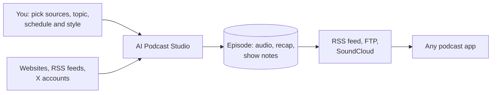

</details>

If anything goes wrong partway through, the app remembers exactly where it got stuck and you can resume from that point with one click, so it doesn't waste money redoing the work that already succeeded.

### Pipeline stages

Every LLM call in the app belongs to one of four stages. A stage is the unit of model choice, cost
and timeout: each one resolves its own model per podcast (falling back to `app.llm.defaults`), gets
its own request timeout, and reports its own token usage and cost. The first three produce an
episode. The fourth reads one back.


<details><summary>Diagram source</summary>

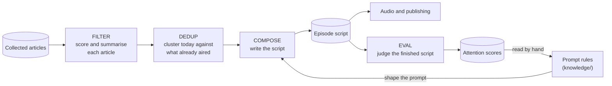

</details>

`FILTER`, `DEDUP` and `COMPOSE` run in order and are what an episode is billed for. `EVAL` is not
part of producing an episode: it runs afterwards, over a script that already exists, so its cost is
recorded on the score rather than on the episode. That separation is deliberate, because an episode
is produced once and may be judged many times.

The return path along the bottom is the point of the whole arrangement, and it is deliberately not
automatic. What the judge measures is read by a person and fed back into the prompt rules, so why a
rule is worded the way it is gets written down where whoever changes it next will find it.

Watching your sources, recording the audio and publishing the episode are not LLM stages and cost
nothing per token. The five steps below walk through the whole run in order, stages and all.

### Step 1: Watching your sources

The app polls your sources continuously in the background, on whatever interval you set per source. Different sites are checked in parallel; sources that share the same host are checked one at a time with a small delay so you don't get rate-limited (this matters for community-run services like Nitter). If a source keeps failing, the app slows down its polling automatically and eventually disables it if the failures look permanent (a 404 or a dead DNS, for example). A client error counts as permanent unless its status asks to be retried (a 408 or a 429), so the dashboard flags a source that is never coming back straight away rather than after hours of backoff. New posts are deduplicated across your sources so an X account and its Nitter mirror don't both add the same content.


<details><summary>Diagram source</summary>

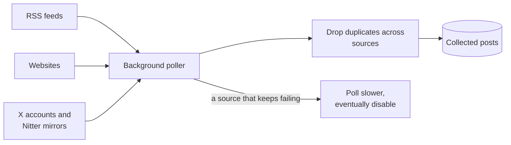

</details>

### Step 2: Picking what's worth covering

When it's time to generate an episode, the app reads the unprocessed posts and turns them into articles. Long-form posts (news articles, blog posts) become one article each. Short-form posts (tweets) are grouped by author and then by conversation: a tweet plus its replies become a single article, with the original tweet's URL and title. Grouping by author first matters when one source is a combined feed carrying many accounts (a Narro feed, say) rather than a single account, so one person's reply chain is never spliced onto someone else's post. A reply continues the conversation before it only when it answers its own author, so an answer someone posted to a different account starts its own article instead of landing in the middle of an unrelated thread of theirs. Narro marks a reply in its own way, which is translated into the same form a Nitter mirror uses while the feed is being read, so threading works identically whichever of the two a source happens to be. Then a fast, cheap language model reads every article and gives it a relevance score from 0 to 10, a short summary, and (if you configured subtopics) tags it with the subtopic it belongs to. Anything below your relevance threshold is dropped. Scoring is the longest part of generation when there's a big backlog, so the dashboard shows it live (for example "Scoring 142 / 318") on the generating episode row.

Most of that work happens before generation starts: when polling a source finishes, its new articles are scored right away rather than waiting for the scheduled run, so the backlog is usually already ranked by the time an episode is due. Eager scoring respects the same per-podcast cost gate as the rest of the pipeline. If the last poll round is nevertheless too old when a scheduled generation begins, a catch-up poll runs first so the episode isn't built from stale sources.

Which articles are on the table is decided by the episode's window rather than by how old an article is, and a window is only worth composing once the sources have caught up with it. See [Episode windows and re-running a past day](#episode-windows-and-re-running-a-past-day).


<details><summary>Diagram source</summary>

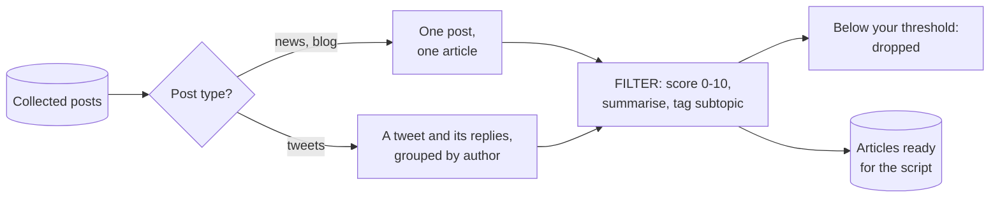

</details>

### Step 3: Writing the script

A second, smarter language model writes the actual episode. Before it starts, the app groups today's articles by topic and compares them against recent episodes: brand-new topics go in fresh, topics that follow up on something covered earlier get a "follow-up" hint so the script can naturally reference previous coverage, and topics you already covered to death get skipped. While writing, the model can search a full-text index of all your past episodes (so it knows what's already been said weeks ago) and can optionally do real web searches via Tavily for extra context on big stories. The opening, transitions, sign-off, and other patterns get rotated automatically so episodes don't all sound the same. The script is written for the day the episode covers, not the day the run happens: the date it announces, whether it gets the extra end-of-week beat, and which patterns it rotates into all come from the end of the episode's window, read in the podcast's timezone. So a re-run or a regeneration of Wednesday's episode still opens as Wednesday's episode, however much later you start it.

A few guards keep this stage predictable: the number of articles fed into a single compose request is capped to the highest-relevance ones so a big backlog can't blow past the model's context, both the compose request and the topic-grouping call ahead of it bound their output tokens (the grouping budget scales with how many articles it has to sort, and a response the model truncates is salvaged rather than thrown away), each stage has a timeout sized to what that stage actually takes rather than one value shared across the pipeline, every request to OpenRouter states the quantizations it will accept and insists the endpoint honour the parameters it sends (the same model is served by two dozen endpoints of varying fidelity, and a lossy one follows instructions worse), each stage states its own reasoning budget, in the form the routed provider actually reads, rather than omitting it and inheriting whatever the routed model happens to do by default (composition plans ahead; topic grouping, scoring and the recap ask for none, since reasoning tokens are billed as output and are drawn from the same allowance as the answer itself, which on a model that reasons by default is enough to consume the whole budget and return nothing), the compose call is retried on a transient provider fault so one malformed response doesn't discard the whole run, and for dialogue and interview styles the speaker tags the model emits are checked against the podcast's configured roles. An invalid tag (a leaked tool-call artifact, say) is re-prompted with a bounded number of retries and, if it persists, fails at the compose stage rather than surfacing later as a missing voice during TTS. The topic grouping is held to its own contract too: a cluster that selects no article at all is invalid, and a response where most of them do that is degenerate and fails the stage loudly, instead of quietly yielding an episode built from a handful of stories.


<details><summary>Diagram source</summary>

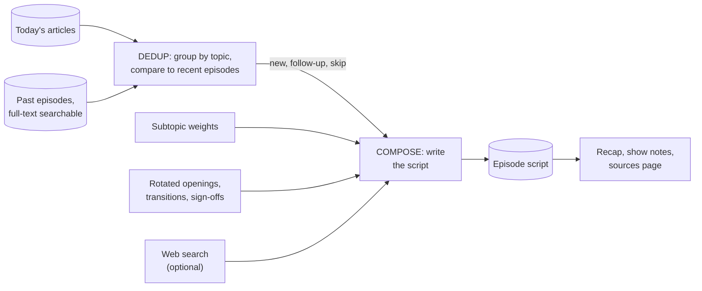

</details>

If you turned on "require review", the pipeline pauses here so you can read, edit, or discard the script before any audio is recorded.

### Step 4: Recording the audio

The finished script is sent to a text-to-speech provider of your choice (OpenAI, ElevenLabs, or Inworld). Before sending, the app cleans the script up for TTS: it strips out em-dashes and en-dashes (which TTS models tend to read out loud as "dash"), and it injects pronunciation hints if you've set up a pronunciation dictionary for the podcast. With Inworld it also vets the delivery directions the script writer wrote: a cue may adjust warmth, energy or pace, but one asking for a flat or hard-to-hear read (deadpan, monotone, whispering) is dropped, because the engine obeys it literally and the turn comes out sounding broken. Phoneme spellings are checked the same way: the script writer may only use IPA for terms in the podcast's pronunciation dictionary, and one it invents for any other word is stripped before synthesis, because the engine reads an unintended transcription out as a mispronounced word. Long scripts are split into chunks at the most natural boundary available (a paragraph break first, then a line break, then a sentence end, then a word gap) so the TTS model doesn't choke and the splices land where a speaker would already pause, then the resulting audio chunks are stitched back together into a single MP3. A short silence is prepended so players don't clip the first word, encoded to match the sample rate, channel count, and bitrate of the speech chunks (providers differ: Inworld returns 48kHz audio, ElevenLabs 44.1kHz). Stitching is a stream copy, so a file whose format changed partway through would be rejected by some podcast platforms. Inworld follows the provider's own generating-speech guidance: every chunk is sent along with the text of the chunks before it, so intonation carries across a splice instead of resetting; free-form delivery directions the script writer emits (`[warm and conversational with an easy pace]`) are re-emitted at the head of each following chunk so a direction isn't lost when a turn is split, and are stripped on models that would read them aloud; non-verbal tags are spelled exactly as Inworld documents them; and the podcast's language is sent explicitly rather than left to auto-detection. It defaults to the `inworld-tts-2` model, exposes Inworld's `STABLE` / `BALANCED` / `CREATIVE` delivery modes per podcast, and offers an **Enhanced Audio Quality** setting, which applies denoising to reduce background noise and artifacts. ElevenLabs and Inworld support multiple voices for dialogue and interview styles; the speaker tags in those scripts are parsed tolerantly, so an occasional malformed tag from the script writer never silently drops a spoken turn. Transient hiccups during generation (a rate limit, a dropped connection, a timeout) are retried automatically per chunk with exponential backoff, so a single flaky request doesn't fail the whole episode.


<details><summary>Diagram source</summary>

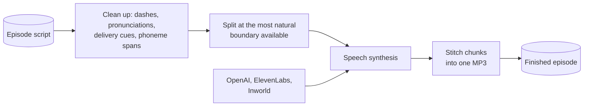

</details>

### Step 5: Publishing, and recovering from failures

The MP3, recap, and show notes become an episode in your podcast's RSS feed. The feed is available two ways: a live HTTP endpoint, and a static `feed.xml` file written to disk so you can host the whole podcast on a static file server, S3, or a CDN. From the dashboard you can also publish individual episodes to FTP or SoundCloud. If anything in steps 2-4 fails partway through (a flaky API, a hit cost limit, a TTS timeout), the app remembers which stage failed and keeps all the work it had already done. A single "Retry" click resumes from that exact stage, so the LLM calls you already paid for aren't repeated. Retrying, regenerating and re-running a whole day are three different things: see [Episode windows and re-running a past day](#episode-windows-and-re-running-a-past-day).


<details><summary>Diagram source</summary>

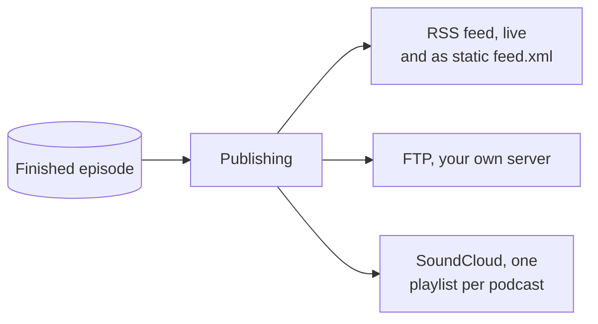

</details>

Each user can create multiple podcasts, each with its own sources, topic, language, models, TTS provider/voices, style, and generation schedule. See [docs/configuration.md](docs/configuration.md) for every setting.

## Episode Windows and Re-Running a Past Day

An episode covers a stretch of time, not "whatever is new". That stretch is the **window**: the
half-open range from the podcast's previous scheduled slot to the slot this run is serving, worked
out from your cron in the podcast's timezone rather than assumed. A weekday-daily schedule gives 24
hours on Tuesday through Friday and reaches back across the weekend on the Monday run, with no
weekday logic written down anywhere.

**Gaps heal themselves.** If an earlier episode failed or was discarded, the window stretches back to
where coverage actually ended, so no day's content is orphaned between two episodes. Failed and
discarded episodes do not count as coverage, which is what makes this work. `app.episode.max-window-days`
(default 7) caps how far back that can reach, so a podcast left idle for a month does not try to
cover the month in one episode.

**The window is stored on the episode**, written once when the episode is created and never
recomputed. That is the feature underneath the feature: a retry, a re-run and a regeneration all
select from the same period the original run started with, instead of recomputing from whatever is
current. The script is written for the day the window ends too, so a re-run of Wednesday's episode
still opens as Wednesday's episode however much later you start it.

**Generation waits for the sources.** While any enabled source has not yet polled past the window's
end, the slot stays due and nothing is created, because composing a window the sources have not
caught up with produces an episode missing its own content. That wait is bounded by
`app.episode.poll-coverage-deadline-minutes` (default 30), after which the episode is generated
anyway and the sources still behind are named in the log.

**Re-running a past day** rebuilds an episode from the window it belongs to:

```
POST /users/{userId}/podcasts/{podcastId}/episodes/{episodeId}/rerun
```

It answers 202 with a new GENERATING episode and leaves the source episode untouched: the re-run is a
new episode with its own status and publications. Two conditions apply. The source episode must be
FAILED or DISCARDED, so a day that is already out has to be discarded first, and its articles must
still be unused, which discarding restores. This is API-only today; the dashboard exposes retry and
regenerate but not re-run.

Re-running is not the same as regenerating. A regeneration recomposes from the articles an episode
already chose, so an episode that failed before it got that far is refused up front with a clear
message rather than producing another failed episode. A re-run goes back to the window and selects
again.

## Script Evaluation

An episode that is factually fine can still lose the listener, and "does this hold attention" is not
something you can grep for. The app measures it in two layers, split because their properties differ
rather than their difficulty.

**Structural metrics** are computed by reading the script and never call a model. Turn counts, words
per speaker and the share each one takes, turn length against the four-sentence cap, backchannel
shaped turns, runs of consecutive turns by one speaker. They are free, stable forever, and always
agree with the script they describe, so they are recomputed on every read and never stored. Read
them at `GET /users/{userId}/podcasts/{podcastId}/metrics` for a podcast, or `.../episodes/{episodeId}/metrics` for one episode.

**The judge** covers what counting cannot. Whether a promise is genuinely deferred depends on what
the turns in between are about, and whether a line is a joke is a judgement. So `EVAL` asks a model
one question per script, and asks it only for **positions, never for measurements**: which turn makes
a forward-looking promise and which turn pays it off, which turns carry a humour beat and who speaks
them, which topics the opening teaser names. Distances, counts, balance and the overall score are
then computed from those turn indices in Kotlin.

That constraint is what makes the judge auditable. An anchor can be checked by opening the script at
that turn and looking; a count or a 1-10 rating cannot be checked, could not be attributed to any
particular rule, and would drift between model versions with nothing to notice the drift. Scores are
versioned and stored with the judge model that produced them, and a comparison refuses to mix rows
from different scorer versions rather than averaging quantities that are not the same quantity.

Both layers are read per episode from the dashboard's **Evaluation** tab, where every anchor the
judge returned is a link to the turn it names.

### Three modes

The judge is configured under `app.eval.judge.mode`:

| Mode | What happens |
|---|---|
| `OFF` | No judge call, no score row, so the feature costs nothing when it is not wanted. |
| `ADVISE` | Every generated episode is judged once, the score is stored and reported, and the episode proceeds whatever it says. The default. |
| `ENFORCE` | The score is compared against `app.eval.judge.norm` and the run acts on the result. |

`app.eval.judge.norm` deliberately has no default, and `ENFORCE` falls back to advising while it is
unset, saying so in the log. Where that line belongs is a fact about the distribution of judged
scores over the archive, not something anyone can reason out in advance: a plausible-looking default
would be indistinguishable in the output from a measured one and would reject episodes on no
evidence. Run in `ADVISE` first, read the distribution, then set a norm.

Scoring is reached over HTTP, never by querying the database:
`POST /users/{userId}/podcasts/{podcastId}/scores` scores a range of episodes (skipping any already
scored at the current version), and `GET .../episodes/{episodeId}/scores` reads them back.

### Comparing prompt variants

A judged score is only useful if two prompt variants can actually be compared, and the composer is
not deterministic, so a variant has to be sampled several times rather than run once. Repeating a
regeneration does not do that on its own: the LLM cache keys on the model and the prompt text and
ignores temperature, so the second and later repetitions would replay the first one's script and
report a spread of zero whatever the model does.

`POST .../episodes/{episodeId}/regenerate?bypassLlmCache=true` is therefore an evaluation run. It
recomposes the same articles with the cache neither read nor written, so each repetition is an
independent sample and nothing an experiment produces displaces what production reads.

Such a run also records what it was composed under, because a difference between two sets of scripts
is only attributable when the conditions of each run are known: the exact prompt's hash, the variety
rotation, the compose model and temperature, whether the bypass actually took effect, which tools
fired, and the episode it produced. Read them at `GET .../evaluation-runs`, or
`GET .../episodes/{episodeId}/evaluation-runs` for one episode. An ordinary generation records
nothing here.

## Knowledge Bundle

`knowledge/` is what we have measured about the models and APIs this project depends on, why the
prompt rules are shaped the way they are, and what has been tried and rejected. It is a plain
[Open Knowledge Format](https://github.com/OpenKnowledgeFormat) v0.2 directory: markdown with YAML
frontmatter, no loader, no build step. Nothing in the application reads it and no automated process
writes to it, which is the point. It is written for whoever changes a prompt next.

It exists because the other stores cannot hold this. Git records what changed and when, the OpenSpec
archive records why a change was made, and neither can state what a measurement showed or what was
tried and abandoned. So an entry records the thing that would otherwise have to be rediscovered: that
steering instructions cost ten seconds of pace per episode, that phoneme spans are mangled under a
creative delivery mode, that turn length is judged by ear and is not a defect.

Every entry carries its provenance. `generated` names the actor that produced the content and when,
`verified` is a separate list of confirmation events so an unchecked entry is distinguishable from
one a person reviewed, and a finding about a third-party model carries the method, the model version
and an absolute `stale_after` instant past which it is a hypothesis to re-measure rather than a fact.
`knowledge/log.md` is newest first, so recent activity reads with
`grep "^## \[" knowledge/log.md | head -10`.

## Architecture

A small Spring Boot backend handles everything (polling sources, running the LLM pipeline, generating audio, publishing). A Next.js dashboard talks to it over HTTP. SQLite holds all state on disk. External providers (LLM, TTS, web research, publication targets) are called from the backend only.

Background work runs on Kotlin coroutines rather than thread pools: coroutine roots never block, blocking I/O (HTTP, database, file, TTS) is confined to `Dispatchers.IO`, transactional work stays on one dispatcher, and provider and publisher abstractions are `suspend` functions. Manually triggered generation follows the same rule: the request starts the run in the background and returns immediately, reporting a conflict if that podcast is already generating.


<details><summary>Diagram source</summary>

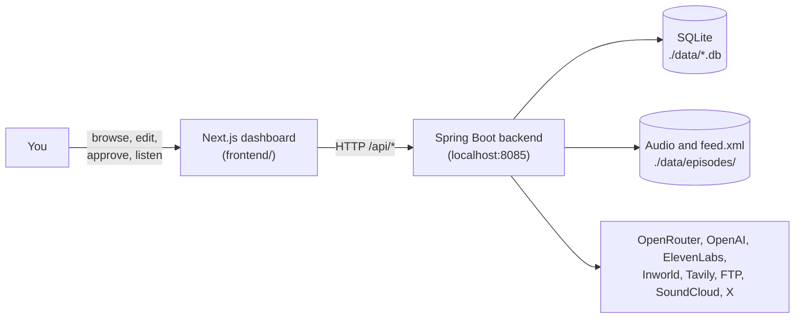

</details>

## Prerequisites

- Java 24+ (Java 25+ requires `--enable-native-access=ALL-UNNAMED` for the SQLite JDBC driver, `start.sh` and `mvnw spring-boot:run` handle this automatically)
- FFmpeg (for audio concatenation and duration detection)
- An LLM provider, one of:
  - [OpenRouter](https://openrouter.ai/) API key (cloud, multiple models)
  - [Ollama](https://ollama.com/) running locally (free, no API key needed)
- A TTS provider, one of:
  - [OpenAI](https://platform.openai.com/) API key (default)
  - [ElevenLabs](https://elevenlabs.io/) API key (for advanced voices and multi-speaker dialogue)
  - [Inworld AI](https://inworld.ai/tts) API key (for expressive voices with rich markup support)

## Setup

1. Install [direnv](https://direnv.net/) and hook it into your shell (e.g. `eval "$(direnv hook zsh)"` in `~/.zshrc`).

2. Create a `.envrc` file in the project root:

   ```bash
   export APP_ENCRYPTION_MASTER_KEY=<base64-encoded 256-bit AES key>
   ```

3. Allow the file: `direnv allow`

Generate an encryption key: `openssl rand -base64 32`

`APP_ENCRYPTION_MASTER_KEY` is the only required environment variable. It is used to encrypt API keys stored in the database.

All other credentials (LLM providers, TTS providers, publishing targets) are managed per-user via the web dashboard or the Provider Configuration API (see [docs/api-reference.md](docs/api-reference.md#provider-configuration)). Optionally, you can set environment variables as global fallbacks for users who haven't configured their own keys:

| Variable | Purpose |
|----------|---------|
| `OPENROUTER_API_KEY` | Global fallback for OpenRouter LLM provider |
| `OPENAI_API_KEY` | Global fallback for OpenAI TTS provider |
| `ELEVENLABS_API_KEY` | Global fallback for ElevenLabs TTS provider |
| `INWORLD_AI_JWT_KEY` / `INWORLD_AI_JWT_SECRET` | Global fallback for Inworld AI TTS provider (combined as `key:secret` for Basic auth) |
| `TAVILY_API_KEY` | Global fallback for the Tavily web-search provider used by the deep-dive research tool (see [docs/deep-dive-research.md](docs/deep-dive-research.md)) |
| `APP_SOUNDCLOUD_CLIENT_ID` / `APP_SOUNDCLOUD_CLIENT_SECRET` | SoundCloud OAuth app credentials (see [docs/publishing.md](docs/publishing.md#publishing-to-soundcloud)) |
| `APP_X_CLIENT_ID` / `APP_X_CLIENT_SECRET` | X (Twitter) OAuth app credentials (see [docs/publishing.md](docs/publishing.md#monitoring-x-twitter-accounts)) |

> **Without direnv?** You can alternatively export the variables in your shell profile (e.g. `~/.zshenv`) or source a `.env` file manually before running the app.

### Provider Configuration

LLM, TTS, and research providers are configured per-user via the **web dashboard** (Settings > API Keys) or the Provider Configuration API. Supported providers:

- **LLM**: `openrouter` (default), `openai`, `ollama`
- **TTS**: `openai` (default), `elevenlabs`, `inworld`
- **Research** (optional, for the deep-dive web-search tool): `tavily`

**Using Ollama (local, free):** Start [Ollama](https://ollama.com/) locally, pull a model (`ollama pull llama3`), then configure it as your LLM provider in the dashboard or via the API. No API key needed, uses `http://localhost:11434/v1` by default.

### Starting the Application

```bash
./start.sh        # runs in background, logs to app.log
./stop.sh         # graceful stop with 10s timeout
```

Or run directly (environment variables are loaded automatically by direnv):

```bash
./mvnw spring-boot:run
```

The app starts on `http://localhost:8085`. Data is stored in `./data/` (SQLite DB + episode audio files).

### Web Dashboard

A Next.js dashboard is available in `frontend/` for visual management of podcasts, episodes, and publications.

```bash
cd frontend && npm run dev
```

The dashboard provides:
- **User settings**, gear icon in the header opens a settings page to edit your profile name and manage API keys (LLM and TTS provider configs) with a wizard-style dialog. All API keys are stored encrypted
- **Podcast overview**, browse all podcasts with style badges, topics, and quick-access settings gear icon
- **Podcast settings**, edit all podcast configuration (general, LLM, TTS, content, publishing) via a tabbed settings page with provider/model dropdowns for LLM and TTS selection. The podcast detail page also has a danger zone for deleting the podcast, which cascades to its episodes, sources, and audio and requires typing the podcast name to confirm
- **Episode management**, view episodes with server-side pagination (10/20/50/100 per page, default 20) and multi-select status filtering; approve/discard/regenerate pending reviews; regenerate audio on generated episodes; retry failed episodes from the stage that failed; play the MP3 inline from the table. Click any episode row to open the detail page. Shows the generation schedule in human-readable form, in the podcast's timezone
- **Episode detail page**, dedicated page per episode with tabs for Script (chat-bubble rendering, each turn labelled with its index), Articles (grouped by source with relevance scores and collapsible sections; an article aggregated from several posts shows its thread size and expands to the individual posts), Publications, **Costs** (per-stage breakdown: scoring, dedup, compose, recap, TTS, research, plus total), and **Evaluation** (the episode's attention score and its components, the script's shape per speaker, the judge's anchors and the metrics' outliers, and the conditions the script was composed under). Every turn index in the Evaluation tab jumps to that turn in the Script tab and highlights it, so a figure can be read against the line that produced it. Shows episode metadata, recap, inline audio player, and contextual action buttons (Approve, Discard, Publish, Regenerate, Regenerate Audio, Retry, Regenerate Recap)
- **Upcoming episode preview**, see collected articles for the next episode (with the same thread expansion as the episode Articles tab), preview the script via Server-Sent Events with live progress through every pipeline stage (aggregating, scoring, deduplicating, composing), and trigger episode generation on demand. Shows next scheduled generation time
- **Sources tab**, manage a podcast's sources in a table that opens on the ones that actually run. The Enabled column header filters on All / Enabled / Disabled, applied by the backend via an `enabled` query parameter, which matters because retired sources are disabled rather than deleted and accumulate
- **Source export**, download all configured sources as a markdown file from the Sources tab
- **Publish wizard**, publish generated episodes to FTP or SoundCloud via a step-by-step wizard. SoundCloud upload quota is freed automatically server-side (oldest podcast tracks are deleted just enough to fit, then the upload retries), and OAuth expiry surfaces a re-authorize action
- **Publications tab**, view all publications across the podcast in one paginated table (newest first) with track/playlist links and republish/unpublish actions

The frontend proxies API calls to `http://localhost:8085` via Next.js rewrites.

## Customizing Your Podcast

Each podcast is configurable end to end: the topic and language, the style (news-briefing, casual, deep-dive, executive-summary, dialogue, interview), the LLM models per pipeline stage, the TTS provider/voices/settings, the schedule (cron + timezone), subtopic weights, custom prompt instructions, a sponsor message, a pronunciation dictionary, cost limits, and more. Per-podcast `requireReview` lets you preview and edit the script before any audio is generated.

See [docs/configuration.md](docs/configuration.md) for the full table of settings, the briefing styles, TTS provider details, model registry, and the cost gate.

### Episode Review

When `requireReview` is enabled on a podcast, the generation pipeline pauses after the LLM produces a script (no audio is generated yet). This lets you review, edit, or discard the script before committing to TTS costs.

The episode workflow is: `PENDING_REVIEW` → (edit script if needed) → `APPROVED` → `GENERATING_AUDIO` (TTS in progress) → `GENERATED`. The `GENERATING_AUDIO` status is persisted in the database so the UI shows a "Generating audio..." spinner across page reloads; on app startup any stale `GENERATING_AUDIO` episodes are recovered as `FAILED`. You can also discard an episode (discarding resets non-aggregated articles so they are included in the next generation run, while aggregated articles from X/Nitter sources are deleted so their posts get re-aggregated fresh with any new posts on the next run). Articles linked to published episodes are never reset or deleted during discard, preventing published content from being reprocessed.

Episodes can be **regenerated** (re-composes the script from the same articles using the current podcast settings, creating a new episode). Regeneration is available for `PENDING_REVIEW` and `DISCARDED` episodes, and is blocked if any episode on the same day has already been published.

Episodes can also be **audio-regenerated** without recomposing the script: a separate `regenerate-audio` action reruns TTS on the existing script (useful after changing the TTS model, voice, `deliveryMode`, or enhanced audio quality) and overwrites the previous MP3. The episode's audio can be played inline from the dashboard via a streaming `audio` endpoint.

Regeneration recomposes with the continuity annotations the original script was written from: the topic grouping records, per story, whether it is new or follows up on earlier coverage, and that is stored on the episode's article links so a regenerated script makes the same calls about what the audience has already heard. The script writer's search over past episodes informs wording, not the running order, so a name recurring in an older story cannot push the day's lead out of the opening.

If the pipeline fails mid-run, the `pipelineStage` is preserved on the episode along with all intermediate state (scored articles, dedup links, script). A **retry** action resumes from exactly the failed stage without re-running earlier LLM work.

A day that has to be done over from the start is a **re-run** instead: `POST /users/{userId}/podcasts/{podcastId}/episodes/{episodeId}/rerun` takes the window of a failed or discarded episode and runs it as a fresh episode, leaving the original in place. Only a failed or discarded episode can be re-run, so a day that is already out has to be discarded first and a re-run never competes with a published episode.

If recap generation produced an empty or low-quality recap, a **regenerate-recap** action recomputes the recap and show-notes from the existing script and re-exports the static feed.

### Cost Tracking

Episode responses include token usage and costs broken down per pipeline stage: **Scoring**, **Dedup**, **Compose**, **Recap**, **TTS**, and **Research**, plus the number of TTS synthesis calls an episode made. LLM cost comes from the provider's own reported charge wherever one is available (OpenRouter returns the exact cost of every call, and a cached call replays the cost of the original), falling back to the per-model rates configured in `application.yaml` for calls that report nothing. Each episode records where its cost came from, so an actual charge is distinguishable from an estimate, including the mixed case where only some stages reported one. Stage costs are tracked with sub-cent precision, so a stage that costs a fraction of a cent is not rounded away to zero. The dashboard renders this breakdown in a dedicated **Costs** tab on the episode detail page. Pricing is configured per model in `application.yaml`; see [docs/configuration.md#model-configuration](docs/configuration.md#model-configuration). Before any LLM call, a **cost gate** estimates the total spend and skips the run if it would exceed a configurable threshold (`maxLlmCostCents` per podcast, or the global `app.llm.max-cost-cents`). The `EVAL` stage is deliberately absent from this breakdown: judging happens after the episode exists and may happen many times, so its cost is recorded on the score row instead. Folding it in would corrupt both the per-episode economics and the cost gate.

## Deep-Dive Web Research

When `deepDiveEnabled` is set on a podcast, the script composer is given a `webSearch` tool backed by [Tavily](https://tavily.com) and may call it (up to 3 times per episode) to fetch outside context for the most newsworthy stories. See [docs/deep-dive-research.md](docs/deep-dive-research.md) for configuration and API key resolution.

## Publishing

Episodes can be published to multiple targets after generation: **FTP** and **SoundCloud** are supported, configured per-podcast, with per-target publication status tracking. Publishing can be automatic: with auto-publish enabled on a target, an episode goes out to that target as soon as generation completes, and a target that fails does not interrupt generation. An optional per-podcast approval gate can require an episode to be explicitly approved for publication first, in which case publishers refuse it until then. Auto-publish additionally refuses an episode built from fewer than `app.publishing.min-articles` articles, since that is usually the symptom of an upstream fault rather than a quiet news day; the episode stays generated and waits for you to publish it by hand. The dashboard's publish wizard handles OAuth and re-auth; SoundCloud upload quota is freed automatically server-side when full. FTP(S) connections encrypt the data channel as well as the control channel, tolerate servers behind NAT, and treat the configured passive/active transfer mode as a preference: the data channel is verified before any file moves, and the other mode is used automatically if the configured one cannot open it. Connection failures name the phase that failed, so a network blocking the FTP port is distinguishable from bad credentials. A publication record says what actually happened to the upload and nothing else. It is written the moment the target accepts the episode, and none of the bookkeeping that follows (the publisher's own hook, the SoundCloud playlist rebuild, the static feed export) can revoke it, though a failure in any of them is logged. A publish that is cancelled stays pending rather than being recorded as a failure, because a cancellation says nothing about whether the upload landed. Republishing depends on that accuracy: an episode regenerated for a date that is already out is found through the earlier record, its track removed, and the new audio uploaded in its place. A SoundCloud playlist rebuild reconciles in the other direction as well, marking a publication unpublished and clearing its external id when the track is gone from SoundCloud, so the dashboard stops claiming an episode is live when it is not.

See [docs/publishing.md](docs/publishing.md) for FTP setup, SoundCloud OAuth, X (Twitter) OAuth for sources, and using Nitter as a free alternative.

## Database Backups

The application can take scheduled, compressed snapshots of its SQLite database. Each backup is produced with SQLite `VACUUM INTO` (a transactionally consistent, compact copy of schema + data, safe to take while the app is running) and gzip-compressed to `data/backups/ai-summary-podcast-<yyyyMMdd-HHmmss>.db.gz`. Older backups beyond the configured retention count are pruned automatically.

The schedule is editable at runtime from the **Settings → Backups** tab (no restart needed): toggle backups on/off, set the cron expression (UTC, with a human-readable preview and next-run time), and set how many backups to keep. A **Back up now** button triggers an immediate backup, and the tab lists existing backups with size and timestamp. Initial defaults come from `app.backup.*` in `application.yaml` (`enabled`, `cron`, `directory`, `retention-count`); the persisted settings are the runtime source of truth.

The admin API lives under `/admin/backup`: `GET/PUT /admin/backup/settings`, `POST /admin/backup` (run now), and `GET /admin/backup` (list).

**Restore:** stop the app, decompress a backup (`gunzip -c data/backups/ai-summary-podcast-<timestamp>.db.gz > data/ai-summary-podcast.db`), remove any stale `-wal`/`-shm` sidecar files, and start the app.

## API

All resources are exposed over HTTP under `/users/{userId}/...`. See [docs/api-reference.md](docs/api-reference.md) for the full endpoint list (users, podcasts, episodes, sources, publishing, OAuth callbacks, SSE events, voices, provider configuration) plus an example podcast-creation payload.

## Running Tests

```bash
./mvnw test
```

Tests use [MockK](https://mockk.io/) for mocking.
